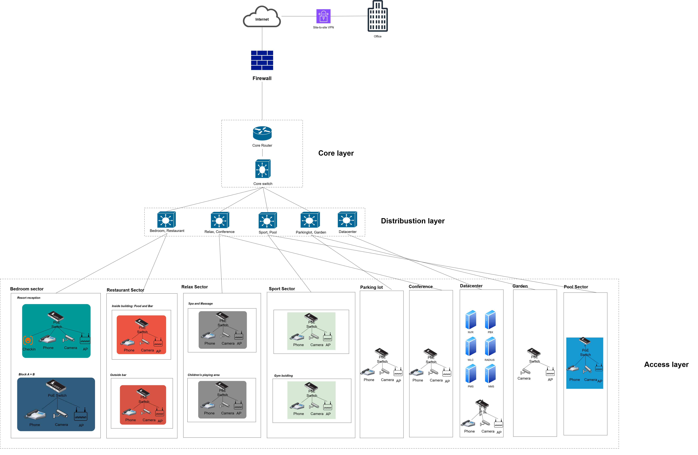
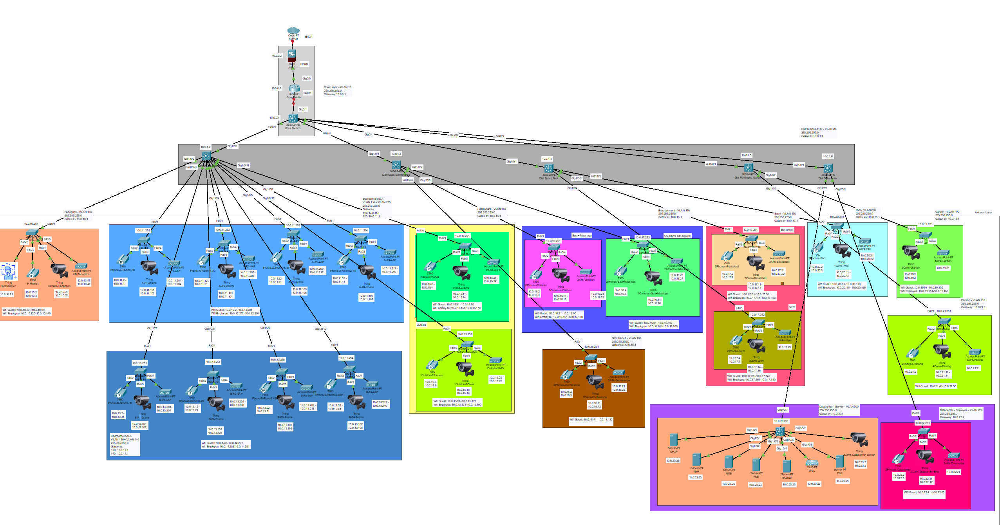

# THIẾT KẾ HỆ THỐNG MẠNG CHO RESORT UIT TẠI THÀNH PHỐ PHAN THIẾT THEO TIÊU CHUẨN TCVN 4391:2015

## THÀNH VIÊN

| **STT** | **Họ và tên**         | **MSSV**   |
|--------:|------------------------|------------|
| **1**   | Đinh Huỳnh Gia Bảo     | 22520101   |
| **2**   | Trần Gia Bảo           | 22520117   |
| **3**   | Phan Minh Phát         | 22521077   |

## CẤU TRÚC

- [Tổng quan đồ án](#tổng-quan-đồ-án)
- [Giới thiệu Resort](#giới-thiệu-resort)
- [Phân tích yêu cầu người dùng ](#phân-tích-yêu-cầu-người-dùng)
- [Phân tích yêu cầu hệ thống](#phân-tích-yêu-cầu-hệ-thống)
- [Sơ đồ Logic](#sơ-đồ-logic)
- [Sơ đồ Vật lý](#sơ-đồ-vật-lý)
- [Sản phẩm cuối cùng](#sản-phẩm-cuối-cùng)

## TỔNG QUAN ĐỒ ÁN

- Đề tài “Thiết kế mạng cho Resort UIT tại thành phố Phan Thiết theo tiêu chuẩn TCVN 4391:2015” được thực hiện với mục tiêu thiết lặp một giải pháp mạng đầy đủ, chi tiết, đáp ứng các yêu cầu đặc thù của một khu nghỉ dưỡng hiện đại, đồng thời đáp ứng đúng các tiêu chuẩn kỹ thuật trong lĩnh vực du lịch – khách sạn. 

- Việc áp dụng tiêu chuẩn TCVN **4391:2015** – Tiêu chuẩn quốc gia về khách sạn – đảm bảo rằng hệ thống mạng không chỉ giúp con người vận hành hiệu quả mà còn phù hợp với quy định của ngành du lịch Việt Nam.

## GIỚI THIỆU RESORT
 
- Resort UIT tại Phan Thiết được mô phỏng là một khu nghỉ dưỡng có diện tích khuôn viên là **10.000m2**, với tổng cộng **80 phòng nghỉ** được bố trí hợp lý, đảm bảo không gian riêng tư và tiện nghi cho từng du khách. Khu vực sảnh và lễ tân được thiết kế rộng rãi, đóng vai trò là trung tâm điều phối hoạt động và đón tiếp khách. Resort còn tích hợp nhiều tiện ích cao cấp như:

    - Nhà hàng và quầy bar phục vụ ẩm thực quốc tế và địa phương, hoạt động cả ngày.
    - Hồ bơi ngoài trời hoặc hồ bơi vô cực, mang đến trải nghiệm thư giãn giữa thiên nhiên.
    - Khu spa, massage và phòng gym hiện đại, hỗ trợ chăm sóc sức khỏe và sắc đẹp cho khách lưu trú.
    - Khu vui chơi trẻ em và sân thể thao, phục vụ nhu cầu giải trí đa dạng cho mọi lứa tuổi.
    - Phòng hội nghị với sức chứa từ 50–100 người, được trang bị đầy đủ hệ thống máy chiếu, âm thanh, ánh sáng chuyên nghiệp, phục vụ các hội thảo, sự kiện, hoặc họp mặt doanh nghiệp.

## PHÂN TÍCH YÊU CẦU NGƯỜI DÙNG

- Yêu cầu Khách hàng: 
    - Kết nối Internet ổn định và nhanh chóng với tốc độ tối thiểu 25 Mbps thông qua mạng
    - Wi-Fi, đảm bảo truy cập mượt mà khi di chuyển giữa các khu vực nhờ khả năng
    - roaming liền mạch.
    - Đăng nhập Wi-Fi một lần (Single Sign-On) sử dụng Captive Portal, hạn chế sự phiền phức khi sử dụng nhiều thiết bị.
    - Trải nghiệm check-in/out nhanh chóng và thuận tiện, có thể lựa chọn check-in tự động qua face check-in hoặc hỗ trợ bởi nhân viên.
    - Thanh toán không tiền mặt, hỗ trợ nhiều hình thức như QR, ví điện tử, thẻ ngân hàng.

- Nhân viên cấp thấp:
    - Truy cập hệ thống PMS (Property Management System) tại các khu vực: lễ tân, nhà hàng, spa để xử lý yêu cầu của khách.
    - Kết nối vào mạng Wi-Fi riêng, đảm bảo bảo mật và tách biệt với mạng khách.
    - Nhận thông báo công việc, thời gian, khu vực làm việc qua ứng dụng nội bộ.
    - Hệ thống liên lạc nội bộ miễn phí hỗ trợ nhắn tin nhóm hoặc gọi giữa các bộ phận.
    - Giao diện đơn giản để báo cáo sự cố kỹ thuật, xử lý nhanh với đội bảo trì.
    - Hệ thống chấm công và xác nhận nhiệm vụ qua app hoặc thiết bị chuyên dụng.
    - Hỗ trợ khách hàng giải quyết các sự cố kết nối cơ bản.

- Ban quản lý:
    - Giám sát toàn bộ hoạt động resort qua hệ thống camera và dashboard tại trung tâm
    - điều hành.
    - Phân tích hiệu suất mạng, lưu lượng sử dụng, chất lượng dịch vụ qua hệ thống giám sát NOC.
    - Phân quyền truy cập, đảm bảo mỗi cấp chỉ truy cập được phần hệ thống cần thiết.
    - Quản lý công suất phòng, doanh thu, lịch sử khách hàng, đề xuất chính sách giá theo mùa vụ.
    - Kết nối VPN site-to-site đến Data Center của tập đoàn UIT để đồng bộ dữ liệu kinh doanh và nhân sự.
    - Truy cập hệ thống từ xa, hỗ trợ điều hành khi không có mặt trực tiếp tại resort.
    - Phân tích feedback khách hàng, hành vi sử dụng dịch vụ để cải thiện chất lượng.
    - Theo dõi hiệu suất làm việc của nhân viên, xác định các vấn đề, đào tạo lại nếu cần thiết.

## PHÂN TÍCH YÊU CẦU HỆ THỐNG

- **Kết nối mạng và băng thông:**
    - Đường truyền Internet tốc độ cao: Tối thiểu 200Mbps download / 100Mbps upload để đảm bảo đáp ứng đồng thời hàng trăm kết nối thiết bị trong giờ cao điểm.
    - Đường truyền dự phòng: Triển khai kết nối từ nhà cung cấp dịch vụ thứ hai để đảm bảo tính sẵn sàng cao và hạn chế tối đa thời gian khắc phục sự cố khi mất mạng.
    - QoS – Quản lý chất lượng dịch vụ: Ưu tiên băng thông cho các dịch vụ quan trọng như hệ thống camera, hệ thống thanh toán, quản lý nội bộ ...
    - Mạng Wi-Fi tốc độ cao, phủ sóng 100% khuôn viên resort, đảm bảo kết nối không bị gián đoạn kể cả trong các khu vực đông người như nhà hàng, phòng hội nghị...
    - Phân chia VLAN theo từng khu vực chức năng và cấp độ người dùng (khách hàng, nhân viên, quản lý) để tăng tính bảo mật và hiệu suất mạng.
    - Kết nối VPN site-to-site với Data Center của tập đoàn UIT, nhằm đồng bộ dữ liệu và quản lý tập trung từ xa.

- **Lưu trữ và bảo mật dữ liệu:**
    - Lưu trữ dữ liệu camera:
        - Ít nhất 30 ngày cho camera thông thường.
        - 90 ngày cho camera giám sát an ninh quan trọng (lưu ở server chuyên dụng)
    - Dữ liệu khách hàng:
        -  Lưu trữ cẩn thận và tuân thủ quy định bảo vệ dữ liệu cá nhân
        - Backup định kỳ mỗi ngày cho dữ liệu khách hàng và giao dịch để phục hồi nhanh chóng khi có sự cố.
    - Mã hóa dữ liệu nhạy cảm: Áp dụng cho thông tin thanh toán, dữ liệu sinh trắc học (khuôn mặt).
    - Kiểm tra bảo mật định kỳ cho hệ thống quản lý phòng và cơ sở dữ liệu
    - Phân quyền truy cập rõ ràng theo chức năng (khách hàng, nhân viên, quản lý) nhằm giảm thiểu nguy cơ rò rỉ dữ liệu.

- **Phần mềm và dịch vụ đám mây:**
    - Phần mềm quản lý khách sạn (PMS): Phải có đầy đủ các module như check-in/out, booking, housekeeping, báo cáo tài chính..
    - Nhận diện khuôn mặt bằng AI: Độ chính xác cao (>99.999%) để hỗ trợ quá trình check-in tự động, nâng cao trải nghiệm người dùng.
    - VMS (Video Management System): Hệ thống quản lý camera có khả năng phân tích video thông minh (phát hiện xâm nhập, chuyển động bất thường…).
    - Đồng bộ dữ liệu giữa resort và trụ sở chính: Đảm bảo hoạt động kinh doanh và dịch vụ không bị gián đoạn.
    - Hệ thống gửi SMS/Email tự động: Cập nhật tình trạng phòng, nhắc nhở giờ checkout, thông báo khuyến mãi ...
    - Phần mềm quản lý sự cố: Theo dõi và xử lý vấn đề kỹ thuật trong hệ thống, có log đầy đủ.
    - Dịch vụ phân tích dữ liệu: Hỗ trợ ban quản lý đưa ra quyết định dựa trên báo cáo hiệu suất và hành vi người dùng.

- **Hỗ trợ kỹ thuật và bảo trì:**
    - Hỗ trợ kỹ thuật 24/7 đối với các hệ thống quan trọng như mạng, PMS, camera ...
    - Bảo trì định kỳ hàng tháng cho hệ thống thiết bị như switch, access point, camera.
    - Kiểm tra an ninh hệ thống hàng tuần để kịp thời phát hiện và khắc phục các lỗ hổng.
    - Cập nhật phần mềm định kỳ hoặc tự động, đảm bảo tính ổn định và bảo mật.
    - Đào tạo nhân viên sử dụng các hệ thống mới để giảm lỗi vận hành.
    - Thiết bị dự phòng sẵn sàng thay thế nhanh chóng (camera, switch, router, máy chủ).
    - Hệ thống giám sát mạng theo thời gian thực giúp phát hiện sớm các sự cố và gửi cảnh báo kịp thời.

## SƠ ĐỒ LOGIC

- **Core Layer (Lớp lõi)**: Đóng vai trò là “xương sống” của mạng. Đây là lớp sẽ tập trung vào chuyển mạch gói tin tốc độ cao, định tuyến liên vùng, kết nối với các thành phần quan trọng như Cloud và Firewall. Đặc biêt, lớp này yêu cầu thiết bị có hiệu suất cao và độ tin cậy lớn như Core Router và Core Switch.
    - Firewall (Tường lửa): Để bảo vệ dữ liệu người dùng và kết nối Internet an toàn hơn, tránh sự xâm nhập của các tội phạm mạng.
    - VPN site-to-site: Giúp kết nối an toàn đến tập đoàn chính.

- **Distribution Layer (Lớp phân phối):** Hoạt động như cầu nối giữa lớp lõi (Core Layer) và lớp truy cập (Access Layer). Lớp này có nhiệm vụ phân phối lưu lượng truy cập giữa các khu vực chức năng của resort, sử dụng các switch chuyên biệt cho từng khu vực như khu phòng ngủ, nhà hàng, khu thể thao, bãi đậu xe, trung tâm hội nghị, vườn, hồ bơi và trung tâm dữ liệu. Đặc biệt, Datacenter đã được chia 1 nhánh riêng cho Datacenter từ Distribution Layer với mục đích:
    - Kiểm soát traffic tốt hơn.
    - Tăng hiệu quả xử lý, dễ dàng mở rộng.
    - Tính bảo mật được đáp ứng.

- **Access Layer (Lớp truy cập):** Thực hiện nhiệm vụ kết nối trực tiếp các thiết bị đầu cuối như IP Camera, IP Phone, Access Point Wi-Fi, và thiết bị kiểm tra khuôn mặt (face check-in) thông qua hệ thống switch PoE.
    - Trung tâm dữ liệu (Datacenter): Được đặt tại resort đảm nhiệm vai trò lưu trữ và vận hành các dịch vụ nội bộ như hệ thống NMS (Network Management System), PBX (Private Branch Exchange) cho điện thoại nội bộ, hệ thống quản lý và điều khiển lưu lượng mạng không dây.

## SƠ ĐỒ VẬT LÝ

## SẢN PHẨM CUỐI CÙNG

- **Báo cáo thiết kế mạng**: Bao gồm phân tích yêu cầu, thiết kế logic, thiết kế vật lý, lựa chọn thiết bị, cấu hình cơ bản, file [Báo cáo thiết kế mạng](Bao%20cao%20TKM%20HK2%202024-2025]%20-%20Nhom%2007.pdf)

- **Sơ đồ thiết kế mạng**: File [logical-design.drawio](logical_final.png) và [physical-design.pkt](physical_topo.png).

- **Mô phỏng mạng**: File [Packet Tracer](physical-design.pkt)

- **Tài liệu thuyết trình**: [Thuyet-trinh-TKM-HK2-2024-2025-Nhom-07.pdf](Thuyet-trinh-TKM-HK2-2024-2025-Nhom-07.pdf)